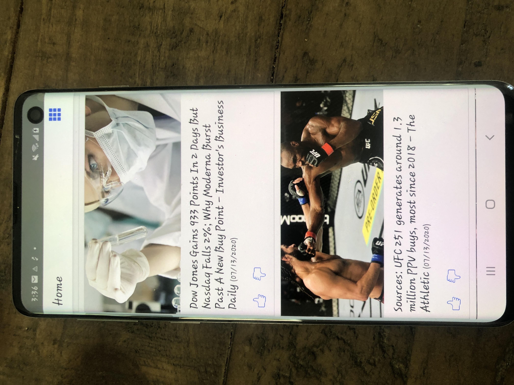

# News
app allows user to view news in Grid and ListView and user can favorite and unfavorite the news.
###### app installatiomn
  - project folder run npm install
  - cd ios and pod install
  - cd .. go back to project folder
  - npx react-native run-ios (For ios)
  - npx react-native run-android (For android)

###### iOS screenshots
  
    

###### android screenshots
  

###### App architecture
- src folder has react native js code
- Redux, Action, Reducer are used to store and retreive data
- Screens folders are used for UI all UI screen
- Http folder is used for making API request
- Test folder is used for running jest enzyme test cases

###### testing
- Home.test.js: UI snapshot testing, Actions snapshots testing, count number of MusicItem loaded on Home screen
- Details.test.js: UI snapshot testing. Due some reason while running test it cannot import module

###### Time spent
I spent 15-20 mins in sketching the UI/UX
I spent around 6 hours of time writing code
I spent around 4 hours of time in testing and covered all unit testing

###### Challenging part
Challenging part of application was to manage state of each Image Component without refreshing entire screen while favorite and unfavorite.

###### Bonus point
- App is in react native.
- Completed assignment using functional component
- UI components have usable animations

